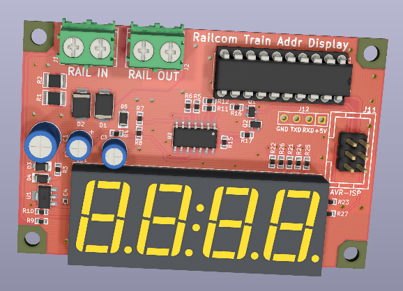

# Railcom (BiDi) Display Unit PCB Data

NMRA DCCの双方向通信規格 (BiDi, Railcom) に準拠した通信信号を受信し、DCC車両のアドレスを表示する機器の基板設計データです。 \
マイコンが取り外せ、基板上に通信信号を横取りできる端子が設けてあるため、Railcom対応機器の開発ベースとしても利用できます。

本リポジトリには、回路図、基板設計データを含みます。

### 主要スペック

  * Railcom Display Unitを介して接続した線路上で動作している、Railcom対応デコーダの車両アドレスを7セグLEDに表示
  * Railcom Channel1 app:adr_low / app_adr_highの受信に対応 \
    (それ以外のRailcomパケットは無視します)

### 動作確認した環境
#### コマンドステーション
  * Roco Z21

#### デコーダー
  * Lenz SILVER+ Mini
  

### 閲覧・編集に必要なCAD (開発環境)
  * KiCad Version (5.1.9)-1 (またはそれ以降)

### 対応するファームウェア
  * [Railcom Train Address Display Unit Firmware for ATtiny2313](https://github.com/ytsurui/railcom-addrdisplay-firmware)

### 各種ドキュメント
  * [パーツリスト](docs/partslist.md)